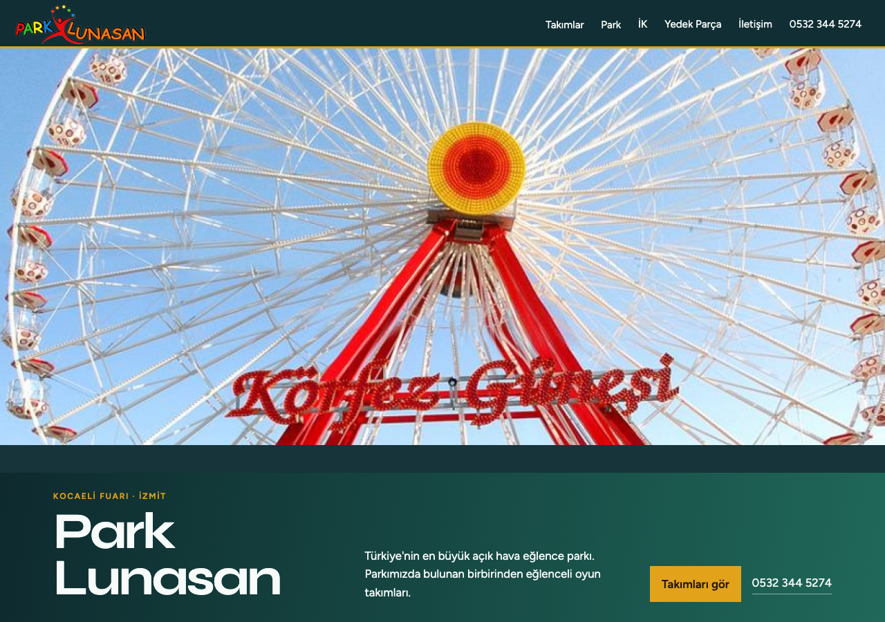
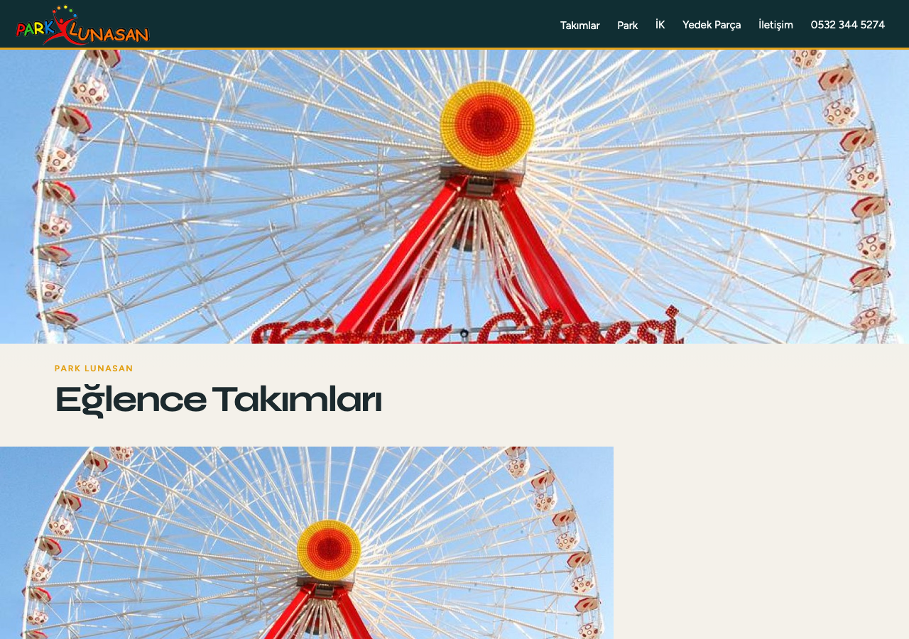
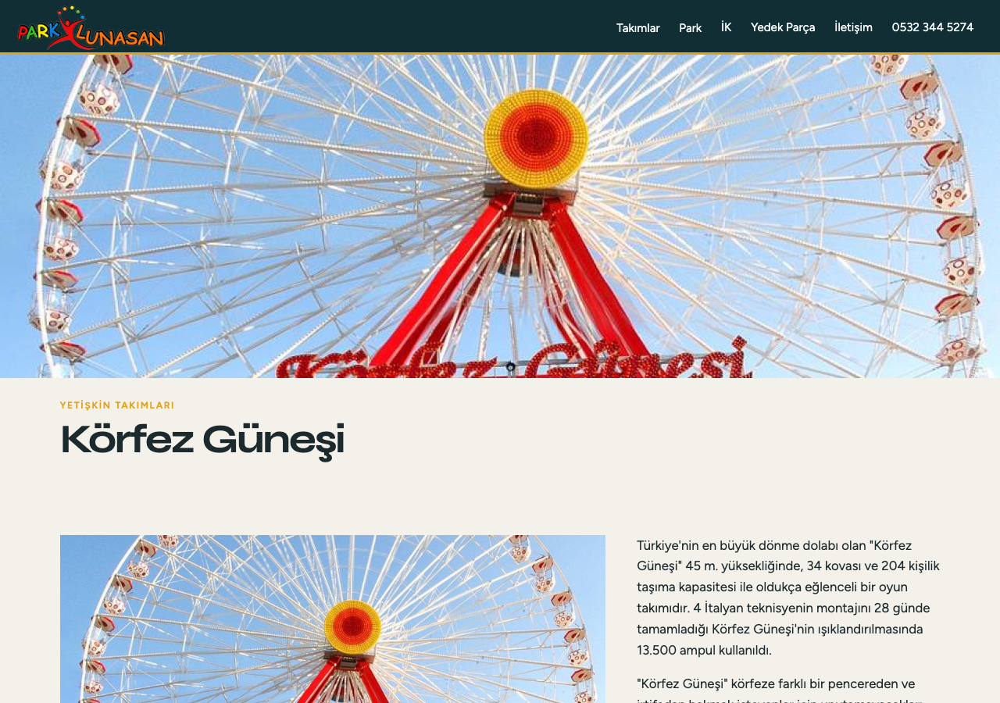
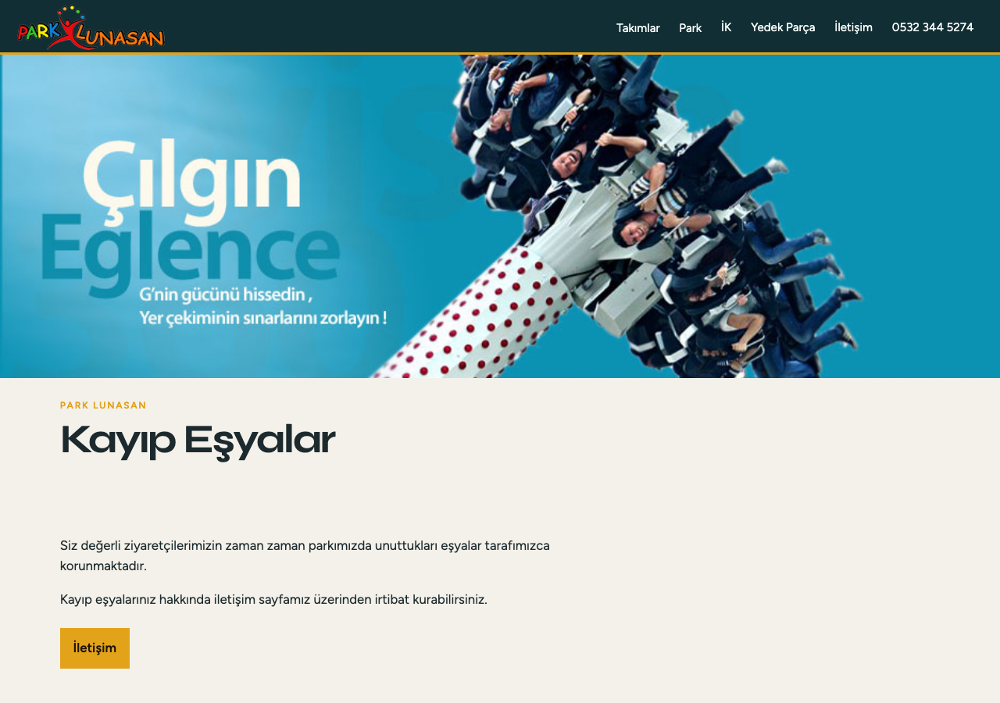

# Park Lunasan

Kocaeli Fuarı’ndaki Park Lunasan’ın sitesi. Takımlar, park bilgisi, insan kaynakları, kayıp eşya ve iletişim ayrı sayfalarda.









## Kurulum

```bash
cd parklunasan
python3 -m http.server 8080
```

Aç: http://127.0.0.1:8080

Takım sayfaları `takimlar/` altında. Yetişkin ve çocuk listeleri `takimlar/yetiskin/` ve `takimlar/cocuk/`.

## Nasıl kuruldu

Çok sayfalı **statik HTML**. Ortak menü ve stiller `assets/styles.css`, `css/site.css` ve `assets/site.js`. Takım kayıtları `assets/rides.js` ve `assets/data.js` içinde. Her oyuncağın kendi `index.html` dosyası var; Körfez Güneşi gibi sayfalar fotoğraf, yükseklik ve kapasite metnini orada taşır.
